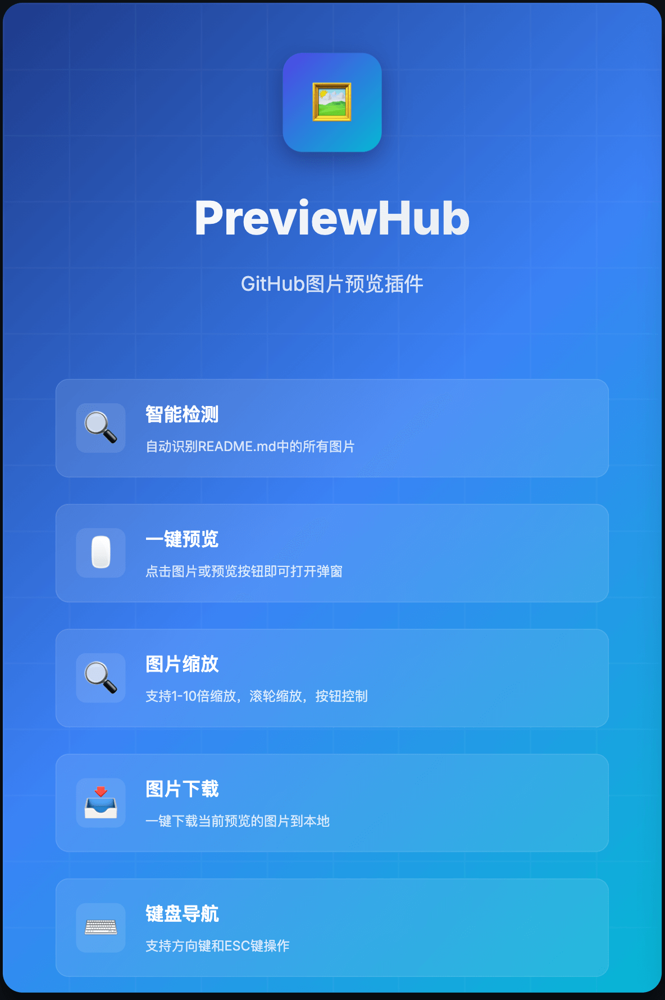
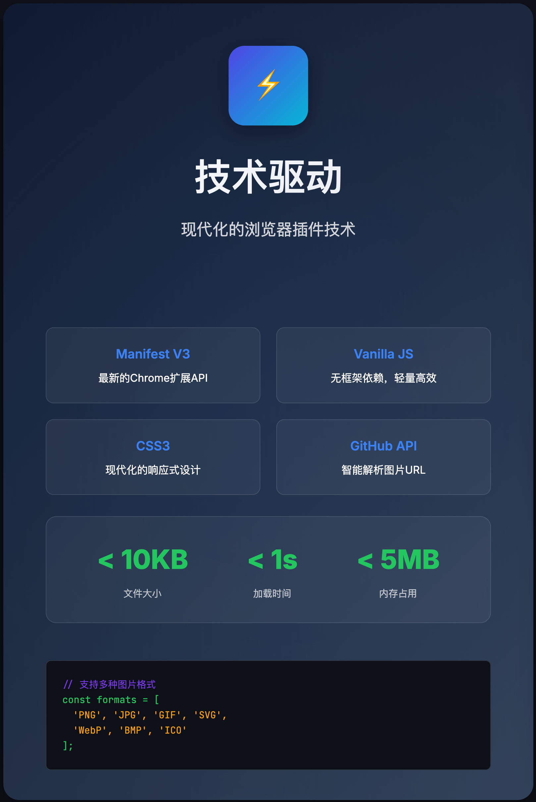
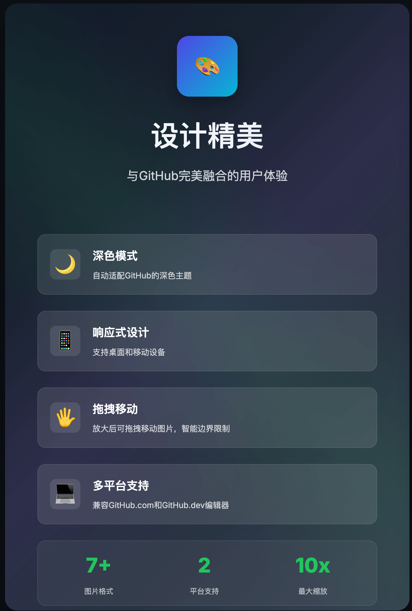

# PreviewHub - GitHub图片预览插件

🖼️ **PreviewHub** 是一个Chrome浏览器插件，让您在GitHub页面上直接预览所有.md文件中的图片，无需跳转到单独的图片页面。同时可以支持打开web ide


[查看演示](./previewTest/1758181332440.gif)


<div style="width: 100%; display: flex">
 
 
 
</div>


### 🎨 图标设计
简约设计融合GitHub与图片预览概念：
- **GitHub蓝色背景** - 体现GitHub生态
- **标准GitHub图标** - 上半部分，清晰的品牌识别  
- **图片预览框** - 下半部分，核心功能表现
- **山峰图标** - 代表图片内容
- **太阳元素** - 增加视觉层次感

## ✨ 功能特性

- 🔍 **智能检测**: 自动识别所有.md文件中的图片（包括README、文档、Wiki等）
- 🖱️ **一键预览**: 点击图片或预览按钮即可打开弹窗
- 🔍 **图片缩放**: 支持1-10倍缩放，滚轮缩放，按钮控制
- 🖐️ **拖拽移动**: 放大后可拖拽移动图片，智能边界限制
- 📥 **图片下载**: 一键下载当前预览的图片到本地（支持多种下载方式）
- 💻 **快速IDE**: 在GitHub页面添加"Open IDE"按钮，一键跳转到github.dev在线编辑器
- 📱 **响应式设计**: 支持桌面和移动设备
- ⌨️ **键盘导航**: 支持方向键和ESC键操作
- 🌙 **深色模式**: 自动适配GitHub的深色主题
- 💻 **多平台支持**: 兼容GitHub.com和GitHub.dev编辑器

## 🚀 安装方法

### 方法一：Edge插件商店（chrome 开发者认证要$5， 我给不起）
1. 访问 [Edge Web Store](#)
2. 点击"添加到Chrome"
3. 确认安装

### 方法二：开发者模式安装
1. 下载Releases 最新版本，解压文件夹
2. 打开Chrome浏览器，访问 `chrome://extensions/`
3. 开启右上角的"开发者模式"
4. 点击"加载已解压的扩展程序"
5. 选择已解压的文件夹

## 📖 使用说明

1. **访问GitHub项目**: 打开任何GitHub项目页面
2. **查看Markdown文件**: 打开任意.md文件（README、文档、Wiki等）
3. **预览图片**: 
   - 点击Markdown文件中的任意图片
   - 或点击"预览图片"按钮
4. **导航浏览**: 
   - 鼠标悬停时显示左右箭头按钮
   - 使用键盘方向键切换图片
   - 点击下载按钮保存图片到本地
   - 点击关闭按钮或按ESC键关闭预览
5. **快速IDE**: 
   - 在GitHub项目页面找到"Open IDE"按钮（位于Code按钮左边）
   - 点击按钮在新标签页中打开github.dev在线编辑器

## ⌨️ 快捷键

- `←` / `→` : 上一张/下一张图片
- `+` / `-` : 放大/缩小图片
- `0` : 重置缩放
- `Esc` : 关闭预览窗口
- **鼠标滚轮** : 缩放图片
- **双击图片** : 重置缩放
- **拖拽** : 移动放大的图片

## 🛠️ 技术栈

- **Manifest V3**: 使用最新的Chrome扩展API
- **Vanilla JavaScript**: 无框架依赖，轻量高效
- **CSS3**: 现代化的响应式设计
- **GitHub API**: 智能解析图片URL

## 📂 项目结构

```
previewHub/
├── manifest.json          # 插件配置文件
├── content.js            # 内容脚本
├── styles.css           # 样式文件
├── popup.html           # 弹窗页面
├── popup.js             # 弹窗脚本
├── icons/               # 图标文件
│   ├── icon16.png
│   ├── icon48.png
│   └── icon128.png
└── README.md            # 说明文档
```

## 🎨 界面预览

### 主要功能
- ✅ 自动检测所有.md文件中的图片
- ✅ 美观的预览弹窗
- ✅ 流畅的图片导航
- ✅ 响应式设计

### 支持的图片格式
- PNG, JPG, JPEG
- GIF, SVG, WebP
- 相对路径和绝对路径
- GitHub raw链接

## 🔧 开发

### 本地开发
```bash
# 克隆仓库
git clone https://github.com/naihe138/previewHub

# 进入目录
cd previewHub

# 在Chrome中加载插件
# 1. 打开 chrome://extensions/
# 2. 开启开发者模式
# 3. 点击"加载已解压的扩展程序"
# 4. 选择项目文件夹
```

### 生成图标
```bash
# 进入图标目录
cd icons

# 打开图标生成器
open create_previewhub_icons.html
```

## 🔧 故障排除

### 下载功能问题
如果图片下载失败，插件会自动尝试以下方法：
1. **Canvas转换下载**: 适用于大部分图片
2. **Fetch请求下载**: 绕过某些CORS限制
3. **Chrome下载API**: 使用浏览器内置下载功能
4. **直接链接下载**: 备用方案

如果所有方法都失败，请：
- 右键点击图片选择"图片另存为"
- 或直接访问图片原始URL进行下载

### 常见问题
- **图片无法预览**: 确保在GitHub项目页面，且当前.md文件包含图片
- **按钮不显示**: 检查是否有.md文件和图片内容
- **缩放不工作**: 尝试刷新页面重新加载插件

## 🤝 贡献

欢迎提交Issue和Pull Request！

1. Fork 项目
2. 创建特性分支 (`git checkout -b feature/AmazingFeature`)
3. 提交更改 (`git commit -m 'Add some AmazingFeature'`)
4. 推送到分支 (`git push origin feature/AmazingFeature`)
5. 打开Pull Request

## 📝 更新日志

### v1.1.0 (2024-12-18)
- 🎉 全面Markdown支持：现在支持所有.md文件的图片预览
- ✨ 智能容器检测：改进Markdown内容检测逻辑
- 🔧 技术改进：重构核心检测方法，保持向后兼容
- 📝 文档更新：更新所有相关文档和描述

### v1.0.0 (2024-12-18)
- 🎉 首次发布
- ✨ 基础图片预览功能（仅README.md）
- ✨ 支持GitHub.com和GitHub.dev
- ✨ 响应式设计和深色模式
- ✨ 键盘导航支持

## 📄 许可证

本项目采用 MIT 许可证 - 查看 [LICENSE](LICENSE) 文件了解详情

## 🙏 致谢

- 感谢GitHub提供优秀的开发平台
- 感谢所有贡献者和用户的支持

---

如果这个插件对您有帮助，请给个⭐️支持一下！
